# 🚀 Santander Dev Week 2023 - Pipeline ETL com IA Generativa


Este projeto é um pipeline **ETL (Extract, Transform, Load)** completo. Ele simula uma API bancária (Backend) e utiliza Inteligência Artificial para gerar mensagens de marketing personalizadas para cada cliente.

---

### **Índice**

* [📝 Descrição do Projeto](#-descrição-do-projeto)
* [⚙️ Tecnologias Utilizadas](#-tecnologias-utilizadas)
* [📁 Estrutura do Projeto](#-estrutura-do-projeto)
* [🚀 Como Executar](#-como-executar)
* [👥 Autor](#-autor)

---

### 📝 **Descrição do Projeto**

O objetivo foi criar um sistema que automatiza a comunicação com clientes:
1.  **Extract:** Lê IDs de usuários de uma planilha CSV e busca seus dados em uma API REST (desenvolvida em FastAPI).
2.  **Transform:** Utiliza a IA do **Google Gemini (Modelo 2.0 Flash)** para gerar uma mensagem de investimento personalizada para cada perfil.
3.  **Load:** Atualiza os dados do usuário na API com a nova mensagem gerada.

#### **Fluxo de Funcionamento**

```mermaid
graph LR
    A[Planilha CSV] -->|Leitura de IDs| B(Pipeline ETL)
    B -->|GET /users| C[API Santander &#40;FastAPI&#41;]
    C -->|Dados do Usuário| B
    B -->|Prompt + Nome| D[Google Gemini AI]
    D -->|Mensagem Personalizada| B
    B -->|PUT /users| C
```




----
### ⚙️ Tecnologias Utilizadas

- Python 3.12: Linguagem principal.

- FastAPI: Framework para construção da API REST (Backend).

- Pandas: Manipulação de dados (leitura de CSV).

- Google Generative AI: Integração com o modelo Gemini 2.0 Flash.

- Requests: Consumo de APIs HTTP.

### 📁 Estrutura do Projeto

```
projeto-santander-ai/
├── api/                    # Backend (Simulando o Banco)
│   ├── src/
│   │   ├── main.py         # Servidor da API
│   │   └── database.json   # Banco de dados (JSON)
├── etl/                    # Pipeline de Dados
│   ├── data/
│   │   └── SDW2023.csv     # Arquivo de entrada
│   ├── src/
│   │   └── pipeline.py     # Script de Automação e IA
├── .env                    # Variáveis de Ambiente (Chaves)
└── requirements.txt        # Dependências
```


----
### 🚀 Como Executar

1. Configuração Inicial
Clone o repositório e instale as dependências:

```
# Crie e ative o ambiente virtual
python -m venv venv
.\venv\Scripts\activate
```
```
# Instale os pacotes
pip install -r requirements.txt
```

2. Configurando a Segurança
Crie um arquivo .env na raiz do projeto e adicione sua chave:

```
GEMINI_API_KEY=Sua_Chave_Google_Aqui
SDW2023_API_URL=[http://127.0.0.1:8000](http://127.0.0.1:8000)
```

3. Executando a API (Terminal 1)
Suba o servidor local:

```
uvicorn api.src.main:app --reload
```

Acesse a documentação em: https://www.google.com/search?q=http://127.0.0.1:8000/docs

4. Rodando o Pipeline ETL (Terminal 2)
Em outro terminal, execute o script de automação:

```
python -m etl.src.pipeline
```
> [!NOTE]
> O script aguardará 60 segundos entre cada requisição para respeitar a cota gratuita da IA.

----

#### 👥 Autor
<a href="https://github.com/amaro-netto" title="Amaro Netto"></a>

Feito com ❤️ e Python.
